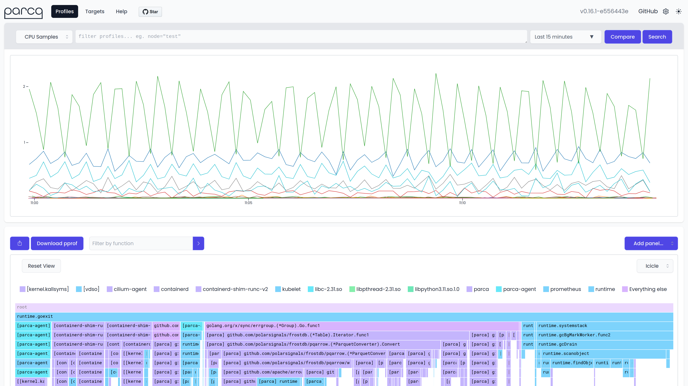

<p align="center">
  <a href="#contributors-" target="_blank">
    
  </a>
</p>
<p align="center">
  
</p>


<p align="center">Continuous profiling for analysis of CPU, memory usage over time, and down to the line number. Saving infrastructure cost, improving performance, and increasing reliability.</p>


<p align="center"></p>

## Features

* [**eBPF Profiler**](https://www.parca.dev/docs/parca-agent/): A single profiler, using eBPF, automatically discovering targets from Kubernetes or systemd across the entire infrastructure with very low overhead. Supports C, C++, Rust, Go, and more!
* **[Open Standards](https://www.parca.dev/docs/concepts/#pprof)**: Both producing pprof formatted profiles with the eBPF based profiler, and ingesting any pprof formatted profiles allowing for wide language adoption and interoperability with existing tooling.

* [**Optimized Storage & Querying**](https://www.parca.dev/docs/storage/): Efficiently storing profiling data while retaining raw data and allowing slicing and dicing of data through a label-based search. Aggregate profiling data infrastructure wide, view single profiles in time or compare on any dimension.

## Why?
* **Save Money**: Many organizations have 20-30% of resources wasted with easily optimized code paths. The Parca Agent aims to lower the entry bar by requiring 0 instrumentation for the whole infrastructure. Deploy in your infrastructure and get started!
* **Improve Performance**: Using profiling data collected over time, Parca can with confidence and statistical significance determine hot paths to optimize. Additionally it can show differences between any label dimension, such as deploys, versions, and regions.
* **Understand Incidents**: Profiling data provides unique insight and depth into what a process executed over time. Memory leaks, but also momentary spikes in CPU or I/O causing unexpected behavior, is traditionally difficult to troubleshoot are a breeze with continuous profiling.

## Feedback & Support

If you have any feedback, please open a discussion in the GitHub Discussions of this project.  
We would love to learn what you think!

## Installation & Documentation

Check Parca's website for updated and in-depth installation guides and documentation!

[parca.dev](https://www.parca.dev/)

## Development

You need to have [Go](https://golang.org/), [Node](https://nodejs.org/en/download/) and [Yarn](https://classic.yarnpkg.com/en/) installed.

Clone the project

```bash
git clone https://github.com/parca-dev/parca.git
```

Go to the project directory

```bash
cd parca
```

Build the UI and compile the Go binaries

```bash
make build
```

### Running the compiled Parca binary

The binary was compiled to `bin/parca` .

```
./bin/parca
```

Now Parca is running locally and its web UI is available on http://localhost:7070/.

By default Parca is scraping it's own pprof endpoints and you should see profiles show up over time. 
The scrape configuration can be changed in the `parca.yaml` in the root of the repository. 

### Credits

Parca was originally developed by [Polar Signals](https://polarsignals.com/). Read the announcement blog post: https://www.polarsignals.com/blog/posts/2021/10/08/introducing-parca-we-got-funded/

## Contributing

Check out our [Contributing Guide](CONTRIBUTING.md) to get started!
It explains how compile Parca, run it with Tilt as container in Kubernetes and send a Pull Request.

## Contributors ✨

Thanks goes to these wonderful people ([emoji key](https://allcontributors.org/docs/en/emoji-key)):
<!-- ALL-CONTRIBUTORS-LIST:START - Do not remove or modify this section -->
<!-- prettier-ignore-start -->
<!-- markdownlint-disable -->
<table>
  <tr>
    <td align="center"><a href="https://brancz.com/"><br /><sub><b>Frederic Branczyk</b></sub></a><br /><a href="https://github.com/parca-dev/parca/commits?author=brancz" title="Code">💻</a> <a href="https://github.com/parca-dev/parca/commits?author=brancz" title="Documentation">📖</a> <a href="#infra-brancz" title="Infrastructure (Hosting, Build-Tools, etc)">🚇</a></td>
    <td align="center"><a href="https://github.com/thorfour"><br /><sub><b>Thor</b></sub></a><br /><a href="https://github.com/parca-dev/parca/commits?author=thorfour" title="Code">💻</a> <a href="https://github.com/parca-dev/parca/commits?author=thorfour" title="Documentation">📖</a> <a href="#infra-thorfour" title="Infrastructure (Hosting, Build-Tools, etc)">🚇</a></td>
    <td align="center"><a href="https://matthiasloibl.com/"><br /><sub><b>Matthias Loibl</b></sub></a><br /><a href="https://github.com/parca-dev/parca/commits?author=metalmatze" title="Code">💻</a> <a href="https://github.com/parca-dev/parca/commits?author=metalmatze" title="Documentation">📖</a> <a href="#infra-metalmatze" title="Infrastructure (Hosting, Build-Tools, etc)">🚇</a></td>
    <td align="center"><a href="https://kakkoyun.me/"><br /><sub><b>Kemal Akkoyun</b></sub></a><br /><a href="https://github.com/parca-dev/parca/commits?author=kakkoyun" title="Code">💻</a> <a href="https://github.com/parca-dev/parca/commits?author=kakkoyun" title="Documentation">📖</a></td>
    <td align="center"><a href="https://github.com/Sylfrena"><br /><sub><b>Sumera Priyadarsini</b></sub></a><br /><a href="https://github.com/parca-dev/parca/commits?author=Sylfrena" title="Code">💻</a> <a href="https://github.com/parca-dev/parca/commits?author=Sylfrena" title="Documentation">📖</a></td>
  </tr>
  <tr>
    <td align="center"><a href="https://github.com/jessicalins"><br /><sub><b>Jéssica Lins </b></sub></a><br /><a href="https://github.com/parca-dev/parca/commits?author=jessicalins" title="Documentation">📖</a></td>
    <td align="center"><a href="http://moiji-mobile.com/"><br /><sub><b>Holger Freyther</b></sub></a><br /><a href="https://github.com/parca-dev/parca/commits?author=zecke" title="Code">💻</a></td>
    <td align="center"><a href="https://github.com/s-urbaniak"><br /><sub><b>Sergiusz Urbaniak</b></sub></a><br /><a href="#infra-s-urbaniak" title="Infrastructure (Hosting, Build-Tools, etc)">🚇</a></td>
    <td align="center"><a href="https://pawel.krupa.net.pl/"><br /><sub><b>Paweł Krupa</b></sub></a><br /><a href="#infra-paulfantom" title="Infrastructure (Hosting, Build-Tools, etc)">🚇</a></td>
    <td align="center"><a href="https://yeya24.github.io/"><br /><sub><b>Ben Ye</b></sub></a><br /><a href="https://github.com/parca-dev/parca/commits?author=yeya24" title="Code">💻</a> <a href="#infra-yeya24" title="Infrastructure (Hosting, Build-Tools, etc)">🚇</a></td>
  </tr>
  <tr>
    <td align="center"><a href="https://github.com/fpuc"><br /><sub><b>Felix</b></sub></a><br /><a href="https://github.com/parca-dev/parca/commits?author=fpuc" title="Code">💻</a> <a href="https://github.com/parca-dev/parca/commits?author=fpuc" title="Documentation">📖</a> <a href="#infra-fpuc" title="Infrastructure (Hosting, Build-Tools, etc)">🚇</a></td>
    <td align="center"><a href="https://cbrgm.net/"><br /><sub><b>Christian Bargmann</b></sub></a><br /><a href="https://github.com/parca-dev/parca/commits?author=cbrgm" title="Code">💻</a></td>
    <td align="center"><a href="https://github.com/yomete"><br /><sub><b>Yomi Eluwande</b></sub></a><br /><a href="https://github.com/parca-dev/parca/commits?author=yomete" title="Code">💻</a> <a href="https://github.com/parca-dev/parca/commits?author=yomete" title="Documentation">📖</a></td>
    <td align="center"><a href="https://responsively.app/"><br /><sub><b>Manoj Vivek</b></sub></a><br /><a href="https://github.com/parca-dev/parca/commits?author=manojVivek" title="Code">💻</a> <a href="https://github.com/parca-dev/parca/commits?author=manojVivek" title="Documentation">📖</a></td>
    <td align="center"><a href="http://thepolishamerican.com/"><br /><sub><b>Monica Wojciechowska</b></sub></a><br /><a href="https://github.com/parca-dev/parca/commits?author=monicawoj" title="Code">💻</a> <a href="https://github.com/parca-dev/parca/commits?author=monicawoj" title="Documentation">📖</a></td>
  </tr>
  <tr>
    <td align="center"><a href="https://github.com/mrueg"><br /><sub><b>Manuel Rüger</b></sub></a><br /><a href="#infra-mrueg" title="Infrastructure (Hosting, Build-Tools, etc)">🚇</a></td>
    <td align="center"><a href="https://github.com/avinashupadhya99"><br /><sub><b>Avinash Upadhyaya K R</b></sub></a><br /><a href="https://github.com/parca-dev/parca/commits?author=avinashupadhya99" title="Code">💻</a></td>
  </tr>
</table>

<!-- markdownlint-restore -->
<!-- prettier-ignore-end -->

<!-- ALL-CONTRIBUTORS-LIST:END -->

<!-- ALL-CONTRIBUTORS-LIST:START - Do not remove or modify this section -->
<!-- prettier-ignore-start -->
<!-- markdownlint-disable -->
<!-- markdownlint-restore -->
<!-- prettier-ignore-end -->
<!-- ALL-CONTRIBUTORS-LIST:END -->

This project follows the [all-contributors](https://github.com/all-contributors/all-contributors) specification. Contributions of any kind welcome!